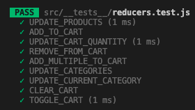

# Excelsior Emporium

Want to buy your favorite Marvel superhero's most valuable items? This e-commerce store is the perfect site for you. This application allows one to buy products based on their favorite Marvel characters including Thor, Iron Man, Captain America, Spiderman, Black Panther, and even the biggest villain Thanos. The user is able to create their own login information which will allow them to shop around the Excelsior Emporium site to add products to their cart and checkout. 

## Table of Contents
* [Installation](#installation)
* [Usage](#usage)
* [Contributions](#contributions)
* [Tests](#tests)
* [License](#license)
* [Questions](#questions)

## Installation
1. Run `npm i` to install dependencies
2. Run `npm run seed` to seed data
3. Run `npm run develop` to launch application on local host

## Usage
- Javascript
- React JS
- GraphQL
- MongoDB
- Mongoose

### Deployed link provided below:
[Excelsior Emporium](https://excelsior-emporium-jcd.herokuapp.com/)

## Contributions
Kishan Shah - Click [here](https://github.com/kishanshah98) for link to Kishan's github

Alyssa Lopez - Click [here](https://github.com/AlyLopez02) for link to Alyssa's github

Jack Doran - Click [here](https://github.com/jcdoran33) for link to Jack's github

## Tests
To run the reducers test, perform `npm run test`.

## License
Apache

## Questions
If you have any questions, please contact us via email at [alylopez0217@gmail.com](mailto:alylopez0217@gmail.com), [jcdoran33@gmail.com](mailto:jcdoran33@gmail.com), [kishan725@gmail.com](mailto:kishan725@gmail.com) or through github at [kishanshah98](https://github.com/kishanshah98), [jcdoran33](https://github.com/jcdoran33), and [AlyLopez02](https://github.com/AlyLopez02)
